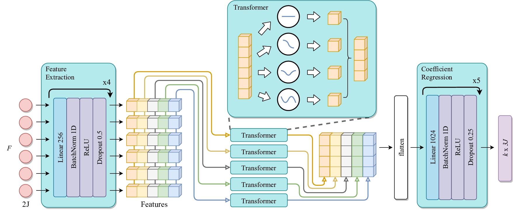

# Trajectory Space Factorization for Deep Video-Based 3D Human Pose Estimation



This repo includes the source code for our BMVC 2019 paper on video-based 3D human pose estimation. We adopt a factorization approach to decompose trajectories along temporal axis and infer the 3D human poses in trajectory space. For details, please read our paper which can be found at [https://arxiv.org/abs/1908.08289](https://arxiv.org/abs/1908.08289).

Bibtex:

```
@inproceedings{lin2019trajectory,
    title={Trajectory Space Factorization for Deep Video-Based 3D Human Pose Estimation},
    author={Lin, Jiahao and Lee, Gim Hee},
    booktitle={BMVC},
    year={2019}
}
```

### Environment

The code is developed and tested on the following environment

* Python 3.5.2
* PyTorch 0.4.1
* CUDA 9.0

### Dataset

The source code is for training and testing on [Human3.6M](http://vision.imar.ro/human3.6m) dataset. Processed data is available [here](https://drive.google.com/open?id=1WqFb5MaZBHbmBm7v6BPM1aXD7ZIGpiRy). Unzip and put all files under the ```data``` directory as shown below:

```
    data
    ├── cameras.h5          (human3.6m camera params)
    ├── train.h5            (human3.6m test data)
    ├── test.h5             (human3.6m training data)
    ├── bases.npy           (a sample set of svd bases)
    └── data_cpn.npz        (2d detections)
```

The data processed in this project are based on the data released by [Martinez et al.](https://github.com/una-dinosauria/3d-pose-baseline) and [Pavllo et al.](https://github.com/facebookresearch/VideoPose3D). Refer to their repos for further information on the data processing.

### Training

To train a model, run:

```
python train.py --bases xxx --input xxx --nframes xxx --nbases xxx --gpu xxx
```

For example, to train on CPN 2d detections with 8 DCT bases on video sequences of 50 frames:

```
python train.py --bases dct --input det --nframes 50 --nbases 8 --gpu 0
```

This will automatically generate an experiment folder under the ```log``` directory with name ```MMDD_HHMMSS_F50_k8_dct_det```.

#### Configurations

Options to configure the training process:

```-b, --bases```: trajectory bases used in experiment, could be ```dct``` or ```svd```.

```-i, --input```: input 2d data to train and test the model, could be ```det``` for 2d detections or ```gt``` for 2d ground truths.

```-f, --nframes```: specify the number of frames of the video sequences processed in the model.

```-k, --nbases```: specify the number of bases used in the model, i.e., first ```k``` trajectory bases will be used for approximation. ```k <= f```.

```-g, --gpu```: id of gpu to use.

These options could also be specified in ```train.py``` for training and ```test.py``` for evaluation.

### Evaluation

A model will be evaluated at the end of training. You can also evaluate a pre-trained model with ```test.py```.

Our pre-trained [models](https://drive.google.com/open?id=1t8w7LK5wltDA-gcm0PIoCZNWjBwDI0xd) are available for download. Place the unzipped models under the ```log``` directory as shown below:

```
    log
    ├── 0422_122443_F50_k8_dct_det
    │   └── ckpt.pth.tar
    └── 0424_175624_F50_k8_dct_gt
        └── ckpt.pth.tar
```

To evaluate on a pretrained model ```exp_tag```, run:

```
python test.py --exp exp_tag --gpu gpu_id
```

For example:

```
python test.py --exp 0422_122443_F50_k8_dct_det --gpu 0
```
